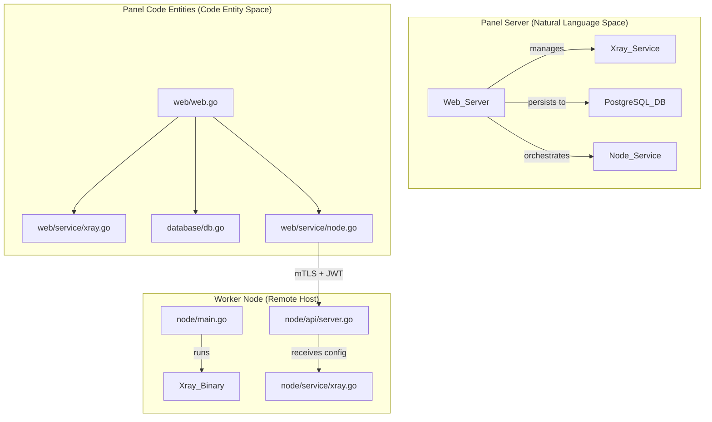
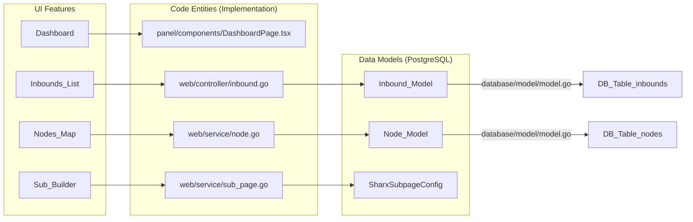

# SharX Overview

Relevant source files

The following files were used as context for generating this wiki page:

- [DockerInit.sh](../DockerInit.sh)
- [README.md](../README.md)
- [README_EN.md](../README_EN.md)
- [README_FA.md](../README_FA.md)
- [README_RU.md](../README_RU.md)
- [config/version](../config/version)
- [go.mod](../go.mod)
- [go.sum](../go.sum)
- [release-notes/v1.3.5.md](../release-notes/v1.3.5.md)

**SharX** is a high-performance fork of the **3XUI** panel, redesigned with a Docker-first philosophy and a focus on multi-node orchestration, advanced observability, and enhanced security. It provides a centralized web interface for managing Xray-core proxy inbounds and VPN clients across multiple distributed worker nodes.

The system transitions from legacy SQLite storage to a robust **PostgreSQL** backend, utilizes **encrypted cookie-based sessions** for security, and features a visual **Subscription Page Builder** to simplify client onboarding.

## System Architecture

SharX operates on a Hub-and-Spoke model where a central **Panel** orchestrates one or more **Worker Nodes**.

### High-Level Component Interaction

The diagram below illustrates how the Panel (Natural Language Space) maps to specific code entities (Code Entity Space) and interacts with Worker Nodes.

"SharX System Context"

Sources: [README_EN.md](../README_EN.md), [web/web.go](../web/web.go), [node/main.go](../node/main.go)

## Key Components

### 1. The Panel (Backend & Frontend)

The Panel is the central brain of the system. It consists of a **Gin-based Go backend** and a **Next.js/React frontend**. It handles:

*   **User & Client Management:** CRUD operations for proxy users and inbounds.
*   **Database Migrations:** Automatic schema evolution via GORM and SQL migration files.
*   **Node Orchestration:** Pushing configurations to remote workers and monitoring their health.
*   **Observability:** Exposing Prometheus metrics and optional Loki log forwarding.

For details, see Core Architecture.

### 2. Worker Nodes

Worker nodes are lightweight agents running on remote servers. They receive configurations from the Panel and manage the local **Xray-core** process.

*   **Pairing:** Securely linked to the Panel via a `SECRET_KEY` bundle (mTLS + JWT).
*   **Autonomy:** Can continue serving clients even if the Panel is temporarily offline.

For details, see Worker Node Service.

### 3. Subscription System

SharX features a sophisticated subscription engine that generates proxy configurations for various clients (VMess, VLESS, Trojan, WireGuard, etc.).

*   **Subscription Page Builder:** A visual block-based editor for the public landing page.
*   **JSON Subscriptions:** Native Xray-compatible JSON output for modern clients.

For details, see Subscription System.

## Navigation Map: Natural Language to Code Entities

The following diagram maps the primary functional areas of the UI and system logic to their respective implementation files and GORM models.

"Feature to Code Mapping"

Sources: [database/model/model.go](../database/model/model.go), [web/controller/inbound.go](../web/controller/inbound.go), [README_EN.md](../README_EN.md)

## Technical Specifications

| Component | Technology |
| :--- | :--- |
| **Language** | Go 1.26 ([go.mod](../go.mod)) |
| **Web Framework** | Gin Gonic ([go.mod](../go.mod)) |
| **Database** | PostgreSQL via GORM ([go.mod](../go.mod)) |
| **Core Proxy** | Xray-core ([go.mod](../go.mod)) |
| **Frontend** | React / Next.js / Tailwind CSS ([README_EN.md](../README_EN.md)) |
| **Authentication** | Encrypted Cookie Sessions & JWT ([README_EN.md](../README_EN.md)) |

## Wiki Structure

This wiki is organized to guide you from initial setup to deep architectural understanding:

1.  **Getting Started & Deployment**: Installation via Docker and script-based deployment.
2.  **Configuration & Settings**: Environment variables and the `SettingService` hierarchy.
3.  **Core Architecture**: Deep dive into the Panel-Worker communication and Xray integration.
4.  **Data Layer**: GORM models and the migration pipeline.
5.  **Inbound & Client Management**: Lifecycle of proxy entities and traffic accounting.
6.  **Subscription System**: How clients receive their configurations.
7.  **Security & Authentication**: mTLS node pairing, JWT, and session management.

Sources: [README_EN.md](../README_EN.md), [release-notes/v1.3.5.md](../release-notes/v1.3.5.md)
